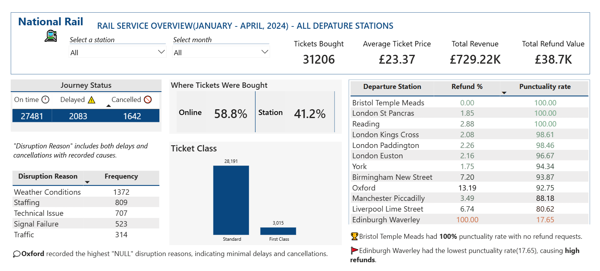
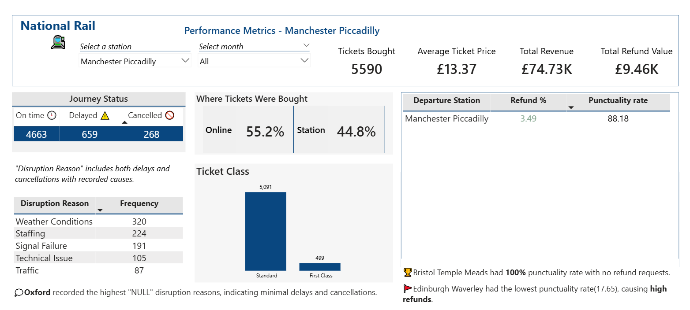

# NATIONAL-RAIL-SERVICE-ANALYSIS

*This is a personal portfolio project for educational and demonstration purposes only. This project is not affiliated to, or endorsed by the National Rail or any UK rail operator*  

This repository contains a set of structured SQL scripts and a Power BI dashboard developed to analyse the operational performance of the National Rail service from January to April,2024. The analysis focuses on key service metrics such as delays, cancellations, refunds, and other performance indicators. 
## OVERVIEW

This project analyzes the UK Railway operations for National Rail, transforming transactional data from January to April,2024 into strategic insights. It examines passenger travel patterns, financial performance across ticket categories, and service reliability metrics to support operational excellence. 
## BUSINESS VALUE
The findings contribute directly to improvements in the following aspects of the rail service: 
#### Revenue & Pricing 
* Quantify the financial impact of operational lapses through analysis of refund-linked revenue loss
* Support informed pricing strategies by identifying underperforming ticket classes or premium offerings 
#### Customer Experience & Retention
* Identify patterns in refund behavior across demographics to tailor communications, improve services , and reduce churn 
#### Resource deployment & optimisation
* Improve forecasting of disruption-prone periods to enable improvement in staffing, train allocation, and operational planning
## TOOLS USED 
#### SQL 
* Data Extraction and loading 
* Data Cleaning 
* Data Normalisation

#### Power BI
* Data Analysis Expression(DAX)
* Data Visualisation 
* Dashboard Design 
## REPOSITORY CONTENTS
#### SQL Scripts 
Each SQL script addresses different aspects of the rail service performance: 
| Script | Content |
|-------------|------------|
data_exploration_and_cleaning.sql | Initial data inspection, integrity checks, duplicates handling, and preparation for analysis 
delay_analysis.sql | Analysis of train delays, delay frequency, average delay durations, and delay reasons across routes 
refund_analysis.sql | Examination of refund trends, identifying refund triggers(delays,cancellations), and their financial impact 
cancellation_analysis.sql | Insights into service cancellations, cancellation rates by routes, and associated reasons
operational_performance(Summary_KPIs).sql | Aggregated performance metrics, summary KPIs, journey disruptions grouped by routes , route reliability
#### Power BI Dashboard 
The interactive dashboard consolidates key operational metrics across all departure stations, and includes filters to view performance data for individual stations. 
This dashboard provides a high-level overview of all rail service performance across all departure stations, enabling stakeholders to: 
* Monitor overall journey disruptions 
* Compare refund and punctuality rates by station
* Track monthly revenue alongside potential loss from refunds 
* Review core KPIs (tickets sold, average ticket price, total revenue, total refund value)
* Analyse ticket sales distribution by purchase channel and class.
   

When a station is selected, as shown below for Manchester Picadilly, the dashboard dynamically filters to display performance metrics, disruption causes, and ticket distribution specific to that station.

  
View the interactive dasboard: [National Rail Analysis Dashboard](https://app.powerbi.com/view?r=eyJrIjoiM2I3NjQ5MjMtNTk5YS00M2NlLWFlMzAtNTBmNmNmZTY3YzNiIiwidCI6Ijk5MzljMjE0LWQ4OGItNDNiYy1iMDhlLTE4ZjQ2N2Y2NWIzNyJ9)
## REQUIREMENTS 
To execute the SQL scripts, you need:  
* A SQL-compatible database (e.g PostgreSQL, MySQL, or SQL Server)  
* Access to the rail service dataset (file is attached)
 
For the Power BI Dashboard:  
* Power BI Desktop or Power BI service  
* The rail service dataset 

## SUMMARY OF INSIGHTS 
Detailed insights can be explored in the SQL scripts provided. Some of the key highlights are: 

#### Operational performance
* The leading causes of journey disruptions were weather conditions and staffing shortages
* The Overall punctuality rate was 93%
* Peak delays occurred during weekday rush hours, and were most frequent in March. 

#### Customer Impact 
* Spikes in refund volume closely coincided with major traffic disruptions
* 72% of refund requests were linked to weekday tickets
* Cancelled journeys generated 26 more refund requests then delays 

#### Route Reliability 
* The least reliable routes, experiencing 100% disruptions, were:  
    1. Edinburgh Waverley⇒London Kings Cross  
    2. York⇒Wakefield  
    3. London Euston⇒York
* The departure stations London St. Pancras, Bristol Temple Meads and Reading all recorded 100% punctuality rates; however, Reading and London St. Pancras still received refund requests due to cancellations originating from those stations.
## RECOMMENDATIONS  

The following actions are recommended to improve operational efficiency, customer satisfaction and revenue retention:  
1. **Leverage data for customer retention**:  Use refund patterns to design targeted loyalty or compensation schemes for frequent commuters
   * Targeted Communication: Notify weekday commuters in advance about service improvements or alternative routes during disruption-heavy periods
   * For customers affected by repeated disruptions, offer automated credit towards future journeys rather than cash refund, keeping them engaged in the service 
2. **Target route reliability improvements** : Develop action plans for the least reliable routes, through infrastructure checks, schedule adjustments, or alternative routing 
3. **Address disruption drivers**: Implement targeted measures to reduce weather and staffing related disruptions, including contingency crew availability, seasonal schedule adjustments , and proactive maintenance planning 
4. **Enhance refund management in high punctuality stations**: Focus on reducing cancellations from stations that generate refund requests despite strong on-time performance by introducing contingency planning,  reallocating resources, and strengthening operational resilience.

## CONCLUSION  
This analysis highlights that while overall punctuality is strong at 93%, underlying operational weaknesses, particularly concentrated in certain routes, time periods, and causes of disruption, continue to impact both revenue and customer trust. Addressing these vulnerabilities will help strengthen railway operations, reduce delays, and deliver a smoother , more reliable travel experience for passengers across the UK. 

Click [here](https://github.com/TeslimahSarayi/ROUTE-RISK-PROFILING) to view the machine learning project developed to segment the travel routes by operational risk
